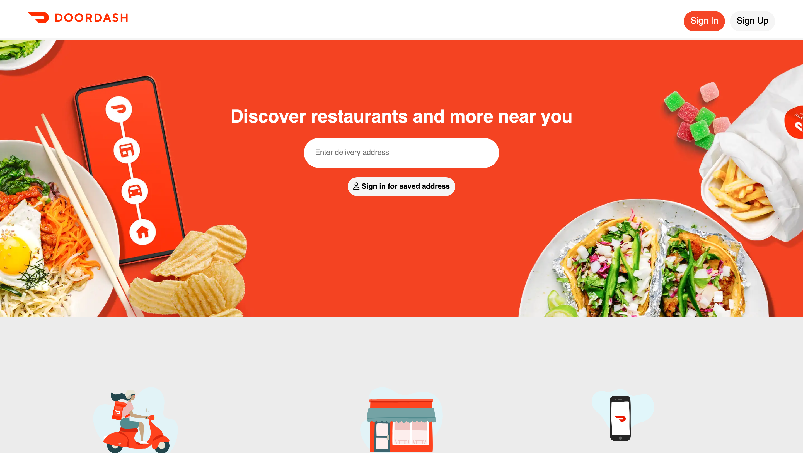

# DoorDash Landing Page Clone

This project is a clone of the DoorDash landing page created using HTML and CSS. It is a static webpage that mimics the design and layout of the original DoorDash homepage.




## Technologies Used

- HTML5
- CSS3

## Getting Started

To get a local copy up and running follow these simple steps.

### Prerequisites

You need a web browser to open the HTML file.

### Installation

1. Clone the repository
   ```sh
   git clone https://github.com/yourusername/doordash-landing-page-clone.git
   ```
2. Open the index.html file in your browser to view the landing page.


## Contributing

Contributions are what make the open source community such an amazing place to learn, inspire, and create. Any contributions you make are greatly appreciated.
